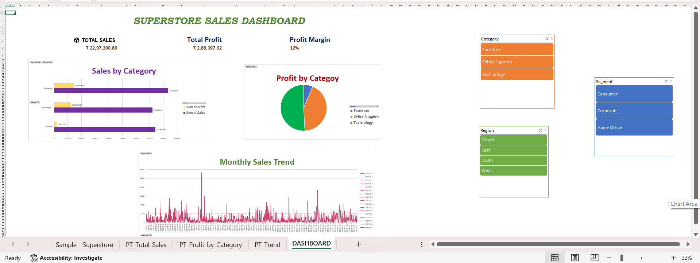
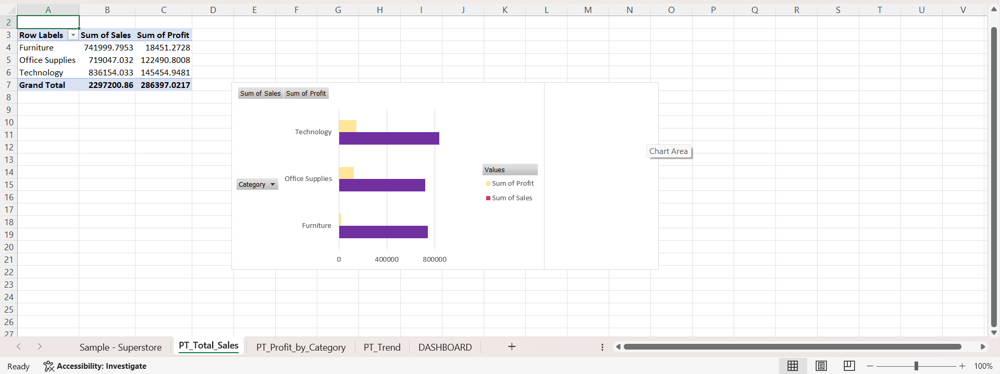
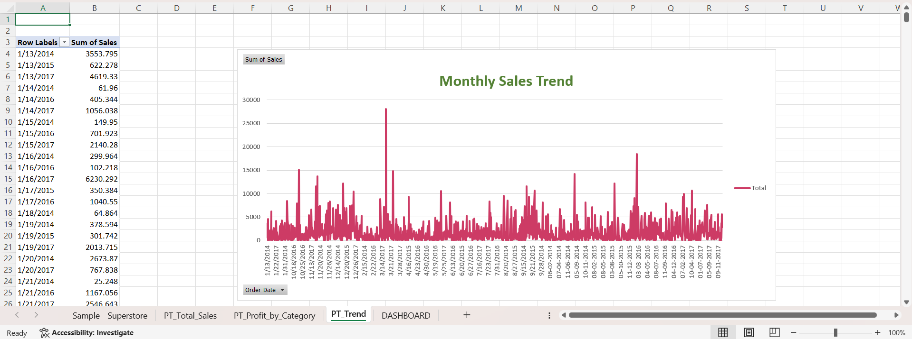
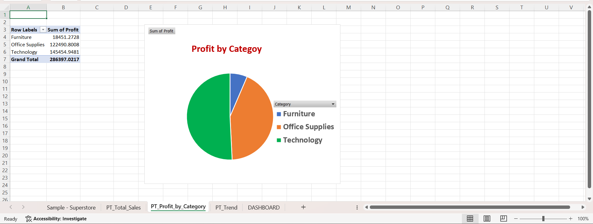
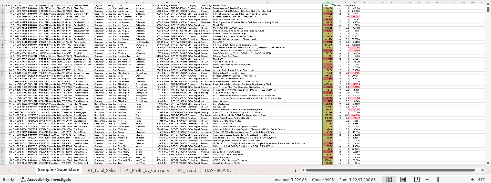

# SCT_DA_1
SkillCraft Technology - Task 1
# Task 1 - Excel Sales Dashboard

This project is part of my Data Analyst Internship at SkillCraft Technology.
## Objective
Analyze and visualize Superstore Sales Data
using Microsoft Excel
## 🛠️ Tool Used

---

## 📂 Dataset
- **Name:** Sample Superstore Sales Dataset
- **Source:** Kaggle
- **Size:** 9,994 rows × 21 columns
- **Key Fields:** Order Date, Category, Sub-Category, Segment, Region, Sales, Quantity, Discount, Profit

---
## What I Built
- Cleaned 9,994 rows of raw sales data
- Created 3 Pivot Tables:
  - Sales by Category
  - Profit by Category
  - Monthly Sales Trend
- Built 3 Charts (Bar, Pie, Line)
- Applied Conditional Formatting
- Designed complete Sales Dashboard
  ---
### Charts
| Chart | Type | Based On |
|-------|------|----------|
| Sales by Category | Clustered Bar | PT_Total_Sales |
| Profit by Category | Pie Chart | PT_Profit_by_Category |
| Monthly Sales Trend | Line Chart | PT_Trend |
---
### Dashboard Features
- ✅ **3 KPI Cards** — Total Sales, Total Profit, Profit Margin
- ✅ **3 Interactive Slicers** — Category, Region, Segment (connected to all pivots)
- ✅ **Conditional Formatting** — Color scales on Profit & Sales 
- ✅ **Clean Layout** — All charts, KPIs, and slicers on a single Dashboard sheet

---

## 💡 Key Business Insights

1. **Technology** leads all categories with **$836,154 in sales** and a **17.4% profit margin**
2. **Furniture** has the lowest profit margin at just **2.5%** despite $742,000 in sales
3. **Tables sub-category** is loss-making with **-$17,725 profit** due to heavy discounting (>40%)
4. **West region** is the most profitable (**$108,418**); Central region needs strategic improvement (**$39,706**)
5. **Consumer segment** drives over **50% of total revenue** ($1,161,401 out of $2,297,201)

---
## 📸 Output Screenshots

### 📊 Dashboard

### 🛒 Sales by Category Chart

### 📈 Sales Trend Chart

### 💰 Profit by Category Chart

### 🎨 Conditional Formatting View

*Submitted as part of SkillCraft Technology Data Analyst Internship — Task 1 of 4*
